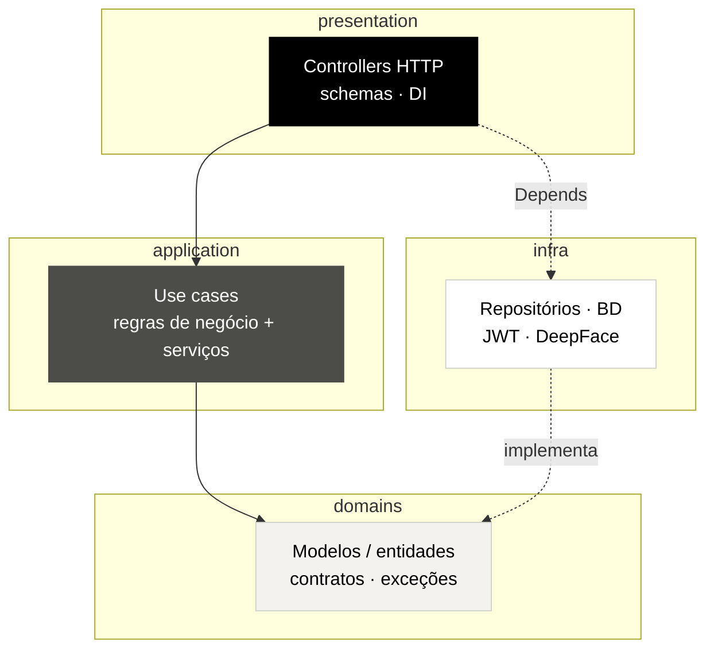

<div align="center">

<picture>
  <source media="(prefers-color-scheme: dark)" srcset="assets/logo/faceclock-logo-white.png">
  <source media="(prefers-color-scheme: light)" srcset="assets/logo/faceclock-logo-black.png">
  
</picture>

<br>
<br>

**Ponto de trabalho vinculado à identidade — batido com o rosto, não emprestável.**

<br>

[](https://www.python.org)
[](https://fastapi.tiangolo.com)
[](https://react.dev)
[](https://github.com/serengil/deepface)
[](docs/adr/0002-clean-architecture-layering.md)
[](docs/adr/0010-adopt-valtech-design-system.md)
[](#licença)

<br>

[**Como usar**](#como-usar) ·
[**Como funciona**](#como-funciona) ·
[**Arquitetura**](#arquitetura) ·
[**Telas**](#telas) ·
[**Documentação**](#documentação) ·
[**Wiki**](https://github.com/luucasorion/FaceClock/wiki)

</div>

---

FaceClock é um sistema de **registro de ponto por reconhecimento facial**. Colaboradores batem
entrada/saída com o rosto; gestores obtêm relatórios de frequência, horas trabalhadas e horas extras
no escopo da empresa. Como o registro é **vinculado à identidade** (embedding facial no servidor), ele
dificulta a batida por terceiros e reduz a conciliação de RH.

> O reconhecimento acontece **no servidor**: os frames são enviados como bytes, o embedding é
> calculado com DeepFace/ArcFace e **as imagens nunca são persistidas no dispositivo** (NFR05).
> Senhas (bcrypt), embeddings e tokens nunca vazam em respostas ou logs (NFR04/NFR05).

## Telas

<div align="center">

<table>
  <tr>
    <td align="center"><br><sub>Totem · relógio ao vivo</sub></td>
    <td align="center"><br><sub>Ponto do colaborador</sub></td>
    <td align="center"><br><sub>Confirmação · anel espectro</sub></td>
  </tr>
</table>

<em>Protótipos hi-fi do rebrand <strong>Valtech Design System</strong> — telas completas (totem, mobile e desktop) e o guia visual no <a href="https://github.com/luucasorion/FaceClock/wiki">Wiki</a>.</em>

</div>

## Funcionalidades

- ✅ **Ponto por reconhecimento facial** — fluxo autenticado (identidade pelo token) e fluxo quiosque/cego (correspondência 1:N).
- ✅ **Regras de ponto aplicadas** — limiar de reconhecimento **0,65** (BR01) e intervalo mínimo de **5 min** (BR02), definidos em fonte única.
- ✅ **Autenticação JWT + papéis** — a claim `gerente` habilita ações de gestor; acesso limitado ao escopo da empresa (BR03/BR06).
- ✅ **Relatórios de frequência** — histórico próprio + resumo diário; relatório da empresa com horas trabalhadas/extras (JSON/CSV).
- ✅ **Segurança por padrão** — bcrypt nas senhas; embeddings/hashes/tokens nunca expostos.
- ✅ **Frontend mobile-first** — SPA React + Vite + MUI, em rebrand para o Valtech Design System.

<details>
<summary><strong>Stack completa</strong></summary>

<br>

| Camada | Tecnologia |
|---|---|
| API | [FastAPI](https://fastapi.tiangolo.com) (Python) |
| ORM / BD | [SQLAlchemy](https://www.sqlalchemy.org) + [SQLite](https://www.sqlite.org) |
| Schemas / config | [Pydantic](https://docs.pydantic.dev) |
| Reconhecimento facial | [DeepFace](https://github.com/serengil/deepface) (ArcFace), no servidor |
| Frontend | [React](https://react.dev) + [Vite](https://vite.dev) + [MUI](https://mui.com) |
| Auth | JWT (claims `sub`/`cpf`/`empresa_id`/`gerente`) |

</details>

## Como funciona

1. **Cadastro (enrollment)** — o embedding facial do colaborador é registrado no servidor por um
   endpoint dedicado; o fluxo de ponto assume cadastro prévio ([ADR 0003](docs/adr/0003-defer-rf13-dedicated-enrollment.md)).
2. **Ponto** — dois fluxos, ambos aplicando BR01 (limiar) e BR02 (intervalo):
   - autenticado — `POST /ponto/`, identidade a partir do bearer token;
   - quiosque/cego — `POST /ponto/embarcado`, identidade por correspondência facial 1:N.
3. **Autenticação e papéis** — o login por senha emite um JWT; papel e escopo da empresa são lidos
   do token ([ADR 0004](docs/adr/0004-role-authz-from-jwt-claim.md)).
4. **Relatórios** — histórico próprio/resumo diário para colaboradores; horas trabalhadas + extras
   da empresa para gestores, no escopo da empresa (BR06).

## Arquitetura

**Clean architecture** — as dependências apontam **para dentro**: `presentation → application →
domain`, com `infra` implementando os contratos do domínio nas bordas
([ADR 0002](docs/adr/0002-clean-architecture-layering.md)).



As convenções do FastAPI seguem o [template full-stack oficial](https://github.com/fastapi/full-stack-fastapi-template),
adaptado à nossa divisão em camadas ([ADR 0001](docs/adr/0001-align-with-fastapi-template-conventions.md)).

```
presentation/   controllers HTTP, schemas de requisição/resposta, DI
application/     casos de uso (regras de negócio) + serviços
domains/         entidades / modelos (e futuros contratos, exceções)
infra/           repositórios, BD, segurança (JWT), tecnologia externa
main.py          app FastAPI + wiring do router
frontend/        SPA React + Vite
```

## Como usar

**1. Clonar**

```bash
git clone https://github.com/luucasorion/FaceClock.git
cd FaceClock
```

**2. Backend** — a partir da raiz do repositório:

```bash
pip install -r requirements.txt
python main.py
```

A API é servida em `http://localhost:8000`, com a documentação interativa em `http://localhost:8000/docs`.

**3. Frontend** — a partir de `frontend/`:

```bash
npm install
npm run dev
```

**4. Configurar** — o backend carrega um `.env` da raiz do repositório. Configure ao menos:

```dotenv
JWT_SECRET=change_me
JWT_EXPIRY_MINUTES=60
HOST=0.0.0.0
PORT=8000
```

> ⚠️ **Altere o `JWT_SECRET` antes de qualquer uso fora do ambiente local** — o padrão é inseguro.
> Gere um forte com `python -c "import secrets; print(secrets.token_urlsafe(32))"`.
>
> O CORS está atualmente como `allow_origins=["*"]` e o tráfego deve ser HTTPS para dados
> biométricos/credenciais (NFR06). Restrinja as origens e termine o TLS antes de implantar.

## Documentação

| Doc | O que cobre |
|---|---|
| [`CLAUDE.md`](CLAUDE.md) | Regras / convenções do projeto (arquitetura, camadas, guardrails) |
| [`PROJECT_CONTEXT.md`](PROJECT_CONTEXT.md) | Requisitos do produto + status de implementação |
| [`docs/adr/`](docs/adr/) | Decisões de arquitetura — [0002 clean architecture](docs/adr/0002-clean-architecture-layering.md) · [0009 gitflow-lite](docs/adr/0009-gitflow-lite-branching.md) · [0010 Valtech DS](docs/adr/0010-adopt-valtech-design-system.md) |
| [Wiki](https://github.com/luucasorion/FaceClock/wiki) | Guia de frontend, Design System e todas as telas (Valtech DS) |
| [Design (handoff)](docs/design/frontend-redesign/) | Fonte da verdade visual: tokens, specs por tela, protótipo e assets |
| [GitHub Issues](https://github.com/luucasorion/FaceClock/issues) | Backlog (labels `P2`/`P3` + domínio); rebrand no épico [#28](https://github.com/luucasorion/FaceClock/issues/28) |

## Fluxo de trabalho Git

Gitflow-lite ([ADR 0009](docs/adr/0009-gitflow-lite-branching.md)): `main` = produção, `dev` =
integração (padrão). Nunca comite direto em `main`/`dev` — crie uma branch (`feat/…`, `fix/…`,
`docs/…`, `chore/…`) e abra PR para `dev`. Commits seguem [Conventional Commits](https://www.conventionalcommits.org).

## Licença

**TBD.** Nenhuma licença foi especificada ainda. Adicione um arquivo `LICENSE` para definir os termos de uso.
