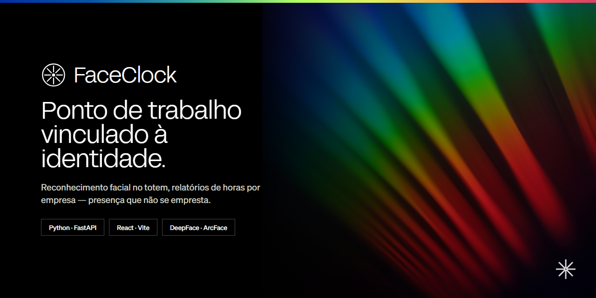
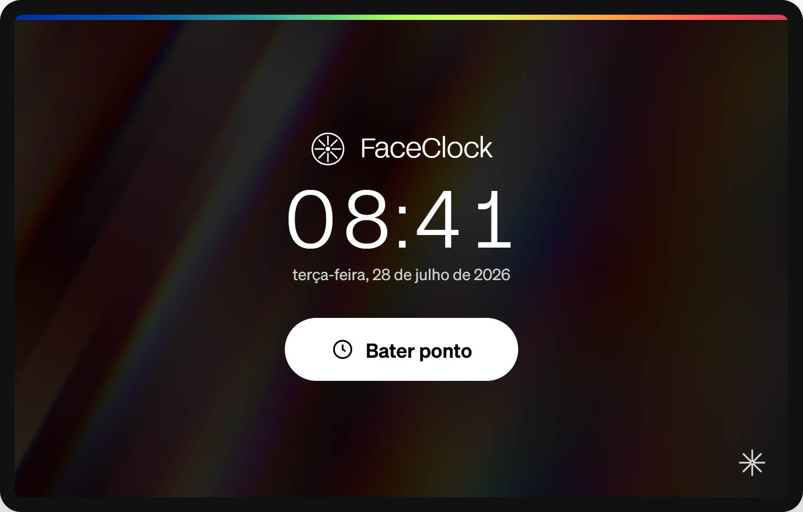
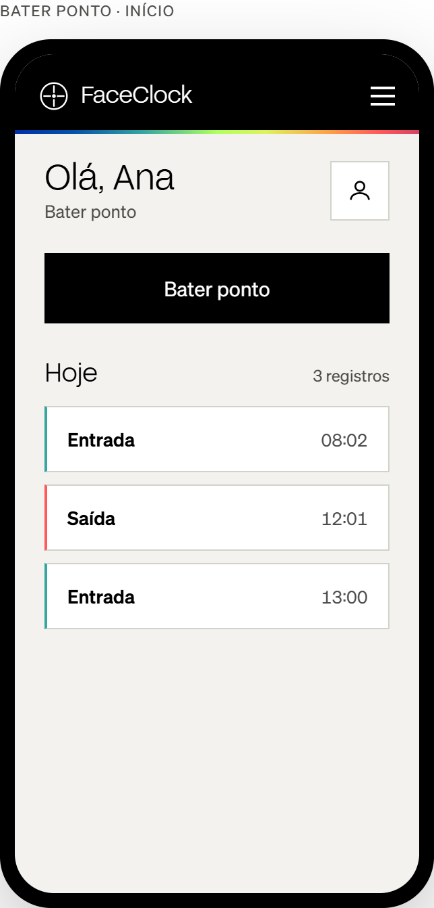
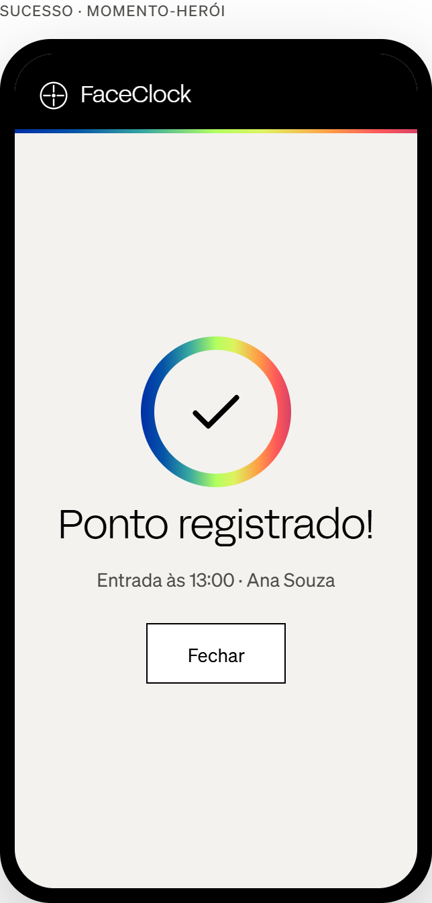
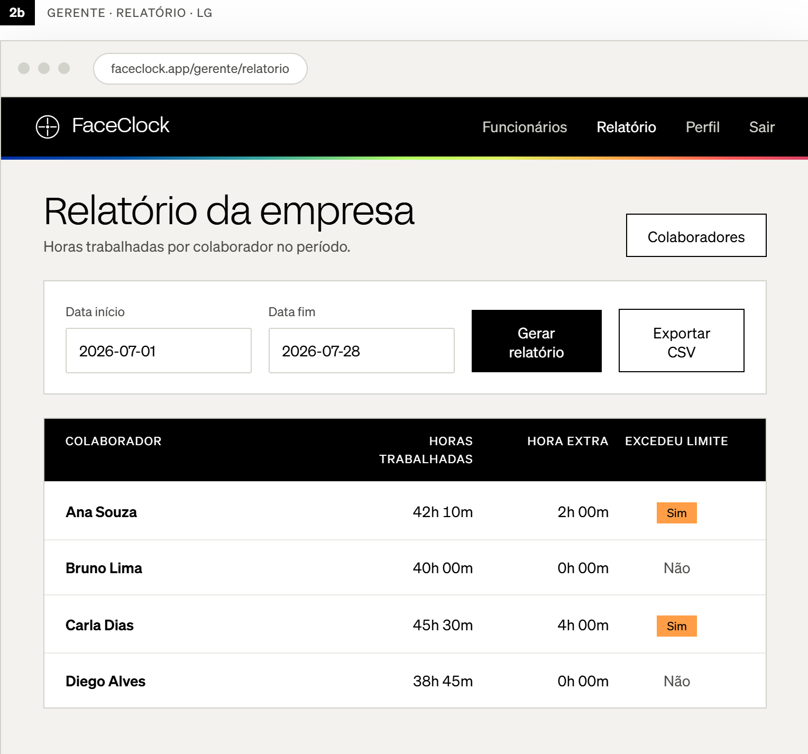

<p align="center">
  
</p>

# FaceClock


Registro de ponto por reconhecimento facial — colaboradores batem entrada/saída com o rosto e
gestores obtêm relatórios de frequência, horas trabalhadas e horas extras no escopo da empresa.
O registro é **vinculado à identidade**, o que dificulta a batida por terceiros e reduz a
conciliação de RH.

## Stack de Tecnologia e Funcionalidades

- ⚡ [**FastAPI**](https://fastapi.tiangolo.com) para a API de backend em Python.
    - 🗄️ [**SQLAlchemy**](https://www.sqlalchemy.org) como ORM Python.
    - 🧾 [**Pydantic**](https://docs.pydantic.dev), usado pelo FastAPI, para os schemas de requisição/resposta e as configurações.
    - 💾 [**SQLite**](https://www.sqlite.org) como banco de dados SQL.
    - 🧠 [**DeepFace**](https://github.com/serengil/deepface) (ArcFace) para geração de embeddings faciais e reconhecimento no servidor.
- 🚀 [**React**](https://react.dev) para o frontend.
    - ⚡ Construído com [**Vite**](https://vite.dev) como single-page app.
    - 🎨 Componentes [**MUI**](https://mui.com) para uma interface responsiva e mobile-first.
    - 📷 Captura de câmera no navegador — os frames são enviados como bytes; os embeddings são calculados no servidor e as imagens nunca são persistidas no dispositivo (NFR05).
- 🏛️ **Clean architecture** — `presentation → application → domain`, com `infra` nas bordas. Veja o [ADR 0002](docs/adr/0002-clean-architecture-layering.md).
- 🔐 **Autenticação JWT** com controle de acesso por papel — uma claim `gerente` habilita ações de gestor; o acesso é limitado ao escopo da empresa (BR03/BR06).
- 👤 **Hashing seguro de senha** por padrão (bcrypt, NFR04); embeddings e hashes nunca vazam em respostas ou logs.
- 🕒 **Regras de ponto aplicadas** — limiar de reconhecimento de 0,65 (BR01) e intervalo mínimo de 5 minutos (BR02).
- 📊 **Relatórios de frequência** — histórico próprio + resumo diário, e um relatório da empresa para o gestor com horas trabalhadas/extras (JSON/CSV).
- 📐 **Decisões registradas como ADRs** e trabalho acompanhado nas **GitHub Issues** — veja abaixo.

## Capturas de Tela

Protótipos hi-fi do rebrand para o **Valtech Design System** ([ADR 0010](docs/adr/0010-adopt-valtech-design-system.md)).
As telas completas (totem, mobile e desktop) e o guia visual estão no
[Wiki do projeto](https://github.com/luucasorion/FaceClock/wiki) e em
[`docs/design/frontend-redesign/`](docs/design/frontend-redesign/).

| Totem (idle) | Ponto do colaborador | Ponto registrado |
|:---:|:---:|:---:|
|  |  |  |

| Relatório da empresa (gestor, desktop) |
|:---:|
|  |

## Como Usar

### 1. Clonar

```bash
git clone https://github.com/luucasorion/FaceClock.git
cd FaceClock
```

### 2. Backend

A partir da raiz do repositório:

```bash
pip install -r requirements.txt
python main.py
```

A API é servida em `http://localhost:8000`, com a documentação interativa em `http://localhost:8000/docs`.

### 3. Frontend

A partir de `frontend/`:

```bash
npm install
npm run dev
```

### 4. Configurar

O backend carrega um `.env` da raiz do repositório. Configure ao menos:

```dotenv
JWT_SECRET=change_me
JWT_EXPIRY_MINUTES=60
HOST=0.0.0.0
PORT=8000
```

⚠️ **Altere o `JWT_SECRET` antes de qualquer uso fora do ambiente local** — o padrão é inseguro. Gere um forte:

```bash
python -c "import secrets; print(secrets.token_urlsafe(32))"
```

> Nota: o CORS está atualmente como `allow_origins=["*"]` e o tráfego deve ser HTTPS para dados
> biométricos/credenciais (NFR06). Restrinja as origens e termine o TLS antes de implantar.

## Como Funciona

- **Cadastro (Enrollment)** — o embedding facial do colaborador é registrado no servidor por meio de um endpoint dedicado; o fluxo de ponto assume cadastro prévio ([ADR 0003](docs/adr/0003-defer-rf13-dedicated-enrollment.md)).
- **Ponto** — dois fluxos: autenticado (`POST /ponto/`, identidade a partir do bearer token) e quiosque/cego (`POST /ponto/embarcado`, identidade por correspondência facial 1:N). Ambos aplicam BR01 e BR02.
- **Autenticação e papéis** — o login por senha emite um JWT (`sub`/`cpf`/`empresa_id`/`gerente`); o papel e o escopo da empresa são lidos do token ([ADR 0004](docs/adr/0004-role-authz-from-jwt-claim.md)).
- **Relatórios** — histórico próprio/resumo diário para colaboradores; horas trabalhadas + extras da empresa para gestores, no escopo da empresa (BR06).

## Estrutura do Projeto

```
presentation/   controllers HTTP, schemas de requisição/resposta, DI
application/     casos de uso (regras de negócio) + serviços
domains/         entidades / modelos (e futuros contratos, exceções)
infra/           repositórios, BD, segurança (JWT), tecnologia externa
main.py          app FastAPI + wiring do router
frontend/        SPA React + Vite
```

As convenções do FastAPI seguem o [template full-stack oficial](https://github.com/fastapi/full-stack-fastapi-template),
adaptado à nossa divisão em camadas — [ADR 0001](docs/adr/0001-align-with-fastapi-template-conventions.md).

## Documentação

- **Regras / convenções do projeto** — [`CLAUDE.md`](CLAUDE.md)
- **Requisitos do produto + status** — [`PROJECT_CONTEXT.md`](PROJECT_CONTEXT.md)
- **Decisões de arquitetura** — [`docs/adr/`](docs/adr/)
- **Fluxo de trabalho Git** — Gitflow-lite, [ADR 0009](docs/adr/0009-gitflow-lite-branching.md)
- **Backlog** — [GitHub Issues](https://github.com/luucasorion/FaceClock/issues) (labels `P2`/`P3` + domínio)
- **Arquivos de tarefas arquivados** — [`docs/archive/`](docs/archive/)

## Licença

Nenhuma licença foi especificada ainda. Adicione um arquivo `LICENSE` para definir os termos de uso.
